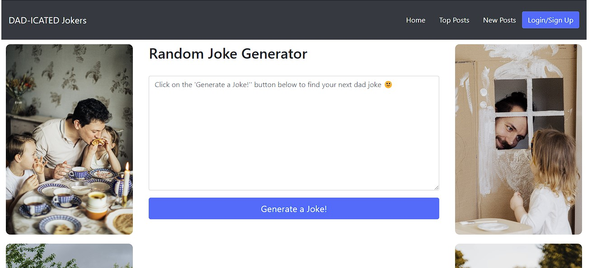
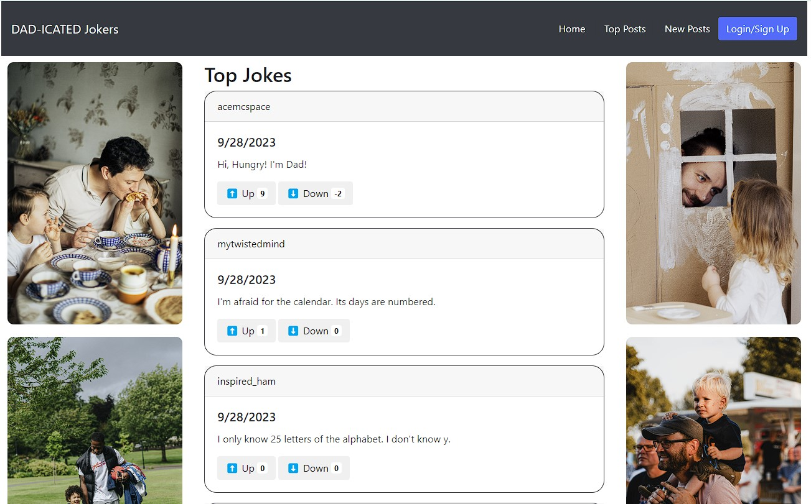
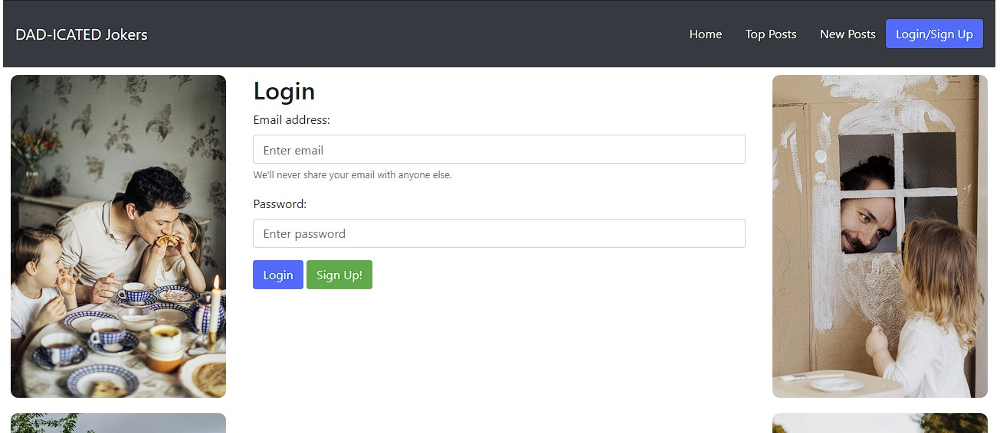

# DAD-ICATED

## Table of Contents
- [DAD-ICATED](#dad-icated)
  - [Table of Contents](#table-of-contents)
  - [Description:](#description)
  - [Installation:](#installation)
  - [Usage:](#usage)
  - [Collaborators:](#collaborators)

## Description:
DAD-ICATED is dad joke ranking application that allows users to see dad jokes - whether in a list or randomly generated - as well as vote on them and submit their own.

The app utilizes a user signup / login system, with future development plans including being able to see jokes the user has submitted and voted on.

## Installation

N/A

## Usage

The application can be accessed via [Heroku](https://dad-icated-6a2b4854840e.herokuapp.com/).

Below are screenshots of the main page, top jokes list, and login / signup

## Collaborators:
  - GitHub: [Elthell](https://github.com/elthell)
  - GitHub: [Dtrieu1](https://github.com/Dtrieu1)
  - GitHub: [PengasKhan](https://github.com/PengasKhan)
  - GitHub: [svnkite](https://github.com/svnkite)